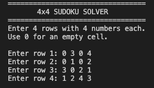
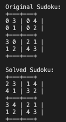

# 4by4sudokusolver
A simple 4x4 Sudoku Solver made in Java.

## Installation

Install Java JDK on your computer.

To check if Java is installed, open the terminal and use:

'''
java -version
'''

To check if the Java compiler is installed:

'''
javac -version
'''

No external Java libraries are required for this project.

## Usage/Examples

First, open the terminal inside the project folder.

Compile all the Java files:

'''
javac src/*.java
'''

Run the program:

'''
java -cp src Main
'''

The program asks the user to enter 4 rows with 4 numbers in each row.
Use `0` for an empty cell.

### Input

The input entered in the terminal is:

'''
=================================
       4x4 SUDOKU SOLVER
=================================
Enter 4 rows with 4 numbers each.
Use 0 for an empty cell.

Enter row 1: 0 3 0 4
Enter row 2: 0 1 0 2
Enter row 3: 3 0 2 1
Enter row 4: 1 2 4 3
'''

### Output

After entering the puzzle, the program displays:

'''
Original Sudoku:
+---+---+
0 3 | 0 4 |
0 1 | 0 2 |
+---+---+
3 0 | 2 1 |
1 2 | 4 3 |
+---+---+

Solved Sudoku:
+---+---+
2 3 | 1 4 |
4 1 | 3 2 |
+---+---+
3 4 | 2 1 |
1 2 | 4 3 |
+---+---+
'''

### Terminal Commands

The complete sequence of commands is:

'''
cd path/to/4x4-sudoku-solver-java
javac src/*.java
java -cp src Main
'''

If the terminal is already opened inside the project folder, only these two commands are needed:

'''
javac src/*.java
java -cp src Main
'''

### Input and Output Screenshots

**Input:**

**Output:**

## Features

- Backtracking to solve 4x4 Sudokus.
- Easy keyboard input for entering the Sudoku puzzle.
- Checks rows, columns, and 2x2 boxes.
- Displays the original and solved Sudoku.
- Handles invalid input using exception handling.
- Uses separate Java classes for different parts of the program.

## Technologies/tools used

- Java
- Java Scanner
- 2D Arrays
- Recursion
- Backtracking
- Exception Handling

## Prerequisites

- Java JDK must be installed.
- `java` and `javac` must be available in the terminal.
- No external libraries are required.

## Project Structure

'''
src/
├── Main.java
├── SudokuBoard.java
├── InputHandler.java
├── SudokuValidator.java
├── SudokuSolver.java
└── SudokuException.java

data/
└── sample.txt

screenshots/
├── input.png
└── output.png

README.md
statement.md
'''

3. Check whether the number is safe.
4. Place the number if valid.
5. Recursively solve the remaining cells.
6. If the choice leads to failure, remove it and try another number.
7. Continue until the puzzle is solved or no solution exists.

